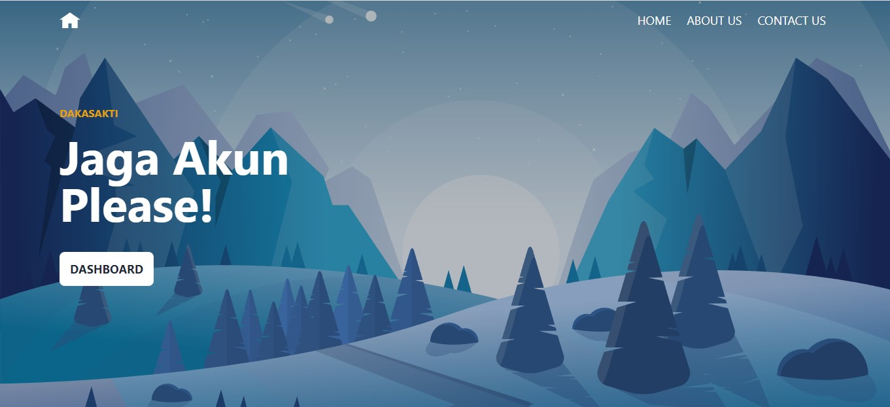
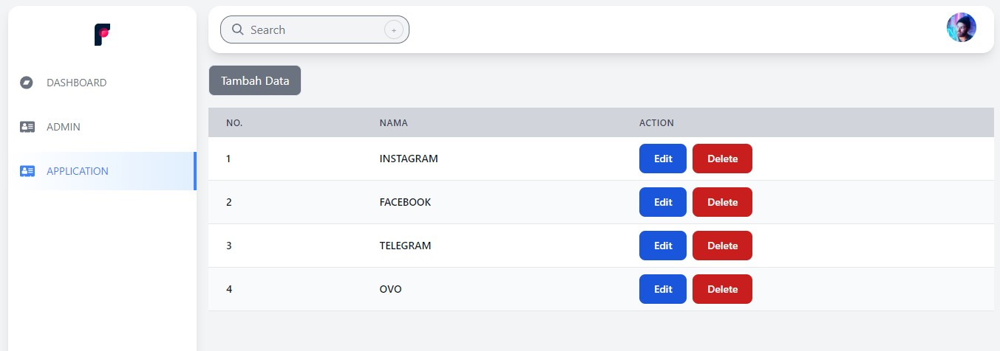
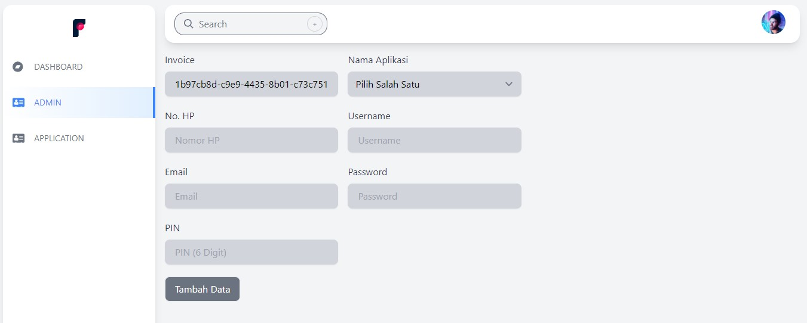

# BANKING

Banking adalah web yang digunakan untuk mengumpulkan data penting yang berisikan nomor hp, username, email, password, dan PIN.

Aplikasi ini dibuat untuk keperluan saya pribadi karena terlalu banyak data social media yang saya gunakan dan keterbatasan saya dalam mengingat password. Ini adalah Web kedua yang saya buat yang sebelumnya adalah blog.

## Feature

-   Register & Login
-   Membuat nama Aplikasi [`CRUD`]
-   Memasukkan data social media sesuai Aplikasi [`CRUD`]

## Webview Example

## Playlist Learn

-   Belajar PHP untuk Pemula https://www.youtube.com/watch?v=l1W2OwV5rgY&list=PLFIM0718LjIUqXfmEIBE3-uzERZPh3vp6
-   OOP Dasar pada PHP https://www.youtube.com/watch?v=ZKDUFoouyBI&list=PLFIM0718LjIWvxxll-6wLXrC_16h_Bl_p
-   Belajar Laravel https://www.youtube.com/watch?v=HqAMb6kqlLs&list=PLFIM0718LjIWiihbBIq-SWPU6b6x21Q_2

> Terima kasih kepada pak Sandhika Galih https://github.com/sandhikagalih yang telah membagikan ilmunya. dan semoga menjadi amal jariyah dan support terus untuk anak bangsa.

## How to Use

-   clone project ini di terminal `git clone https://github.com/dakasakti/banking.git`
-   ganti nama file `.env.example` to `.env` dan sesuaikan configuration
-   selesai. Selamat mencoba.

## TechStack

-   PHP https://www.php.net/
-   Framework Laravel https://laravel.com/
-   CSS Tailwind https://tailwindcss.com/

## Contributing

-   MAHMUDA KARIMA (Daka)

## License

-   Open Source
-   Created January, 28th 2022
